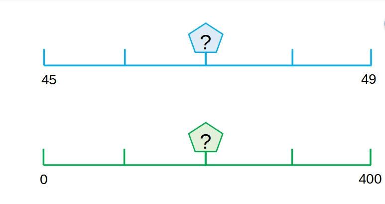

Bon, en fait, Mireille a 2 projets à nous proposer.

On va commencer par le 01 qui ne nécessite pas de bases de données à priori, puisqu'il n'y pas à enregistrer ni session utilisateur, ni progression, etc ...
En fait, il s'agit simplement d'un outil que Mireille souhaite éxécuter elle même et projeter le contenu sur son TBI.

Le concept déjà pour présenter :

C'est très simple, ce sont des droites numériques. L'élève doit deviner le nombre à la place du "?"

Donc voilà en résumé ce que doit faire le programme.

1) L'enseignant éxécute le programme; les enfants à priori ne l'utilisent pas en autonomie (on pourra en reparler)

2) 2 droites numériques (une bleue et une verte sur l'exemple) doivent être affichées en même temps, chacune correspondant à un niveau (classe CE1 / classe CE2)

3) L'élève doit deviner le nombre "?"

4) Le nombre de départ X (dans l'exemple c'est 45 sur la droite bleue) est compris entre 0<=X<=900 pour la droite bleue correspondant au niveau CE1; ce nombre est affiché
    Le pas appartient à l'ensemble {1;2;5;10;100}; dans l'exemple de la droite bleue, le pas est égal à 1.
    Le nombre de graduation Y est compris entre 1<=Y<=10
    Le nombre à deviner "?" est placé aléatoirement sur une graduation 
    Le nombre de fin est calculé et affiché  

5) Le nombre de départ X (dans l'exemple c'est 0 sur la droite verte) est compris entre 0<=X<=10000 pour la droite verte correspondant au niveau CE2; ce nombre est affiché
    Le pas appartient à l'ensemble {1;2;5;10;100,1000}; dans l'exemple de la droite verte, le pas est égal à 100.
    Le nombre de graduation  Y est compris entre 1<=Y<=10
    Le nombre à deviner "?" est placé aléatoirement sur une graduation   
    Le nombre de fin est calculé et affiché  

6) Le nombre "?" doit se dévoiler quand on clique dessus

7) Il faut laisser à l'enseignement la possibilité de créer à la demande des droites numériques en choisissant les paramètres X, Y, pas et éventuellement le placement du nombre "?"
